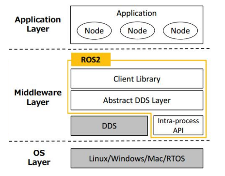

# ROS2文件系统
## ROS2系统架构
立足系统架构，如下图所示，ROS2可以划分为三层：
- **操作系统层（OS Layer）**
如前所述，ROS虽然称之为机器人操作系统，但实质只是构建机器人应用程序的软件开发工具包(SDK)，ROS必须依赖于传统意义的操作系统，目前ROS2可以运行在Linux、Windows、Mac或RTOS上。

- **中间层（Middleware Layer）**
主要由数据分发服务DDS与ROS2封装的关于机器人开发的中间件组成。DDS是一种去中心化的数据通讯方式，ROS2还引入了服务质量管理 （Quality of Service）机制，借助该机制可以保证在某些较差网络环境下也可以具备良好的通讯效果。ROS2中间件则主要由客户端库、DDS抽象层与进程内通讯API构成。

- **应用层（Application Layer）**
是指开发者构建的应用程序，在应用程序中是以功能包为核心的，在功能包中可以包含源码、数据定义、接口等内容。


对于一般开发者而言，工作内容主要集中在应用层，开发者一般通过实现具有某一特定功能的功能包来构建机器人应用程序。对应的我们所介绍的ROS2文件系统主要是指在硬盘上以功能包为核心的目录与文件的组织形式。

## 1. 概览
功能包是ROS2应用程序的核心，但是功能包不能直接构建，必须依赖于工作空间，一个ROS2工作空间的目录结构如下：
```
WorkSpace --- 自定义的工作空间。
    |--- build：存储中间文件的目录，该目录下会为每一个功能包创建一个单独子目录。
    |--- install：安装目录，该目录下会为每一个功能包创建一个单独子目录。
    |--- log：日志目录，用于存储日志文件。
    |--- src：用于存储功能包源码的目录。
        |-- C++功能包
            |-- package.xml：包信息，比如:包名、版本、作者、依赖项。
            |-- CMakeLists.txt：配置编译规则，比如源文件、依赖项、目标文件。
            |-- src：C++源文件目录。
            |-- include：头文件目录。
            |-- msg：消息接口文件目录。
            |-- srv：服务接口文件目录。
            |-- action：动作接口文件目录。
        |-- Python功能包
            |-- package.xml：包信息，比如:包名、版本、作者、依赖项。
            |-- setup.py：与C++功能包的CMakeLists.txt类似。
            |-- setup.cfg：功能包基本配置文件。
            |-- resource：资源目录。
            |-- test：存储测试相关文件。
            |-- 功能包同名目录：Python源文件目录。
```

另外，无论是Python功能包还是C++功能包，都可以自定义一些配置文件相关的目录。

```
|-- C++或Python功能包
    |-- launch：存储launch文件。
    |-- rviz：存储rviz2配置相关文件。
    |-- urdf：存储机器人建模文件。
    |-- params：存储参数文件。
    |-- world：存储仿真环境相关文件。
    |-- map：存储导航所需地图文件。
    |-- ......
```
上述这些目录也可以定义为其他名称，或者根据需要创建其他一些目录。

## 2.源文件说明
在1.3 ROS2快速体验中，实现第一个ROS2程序时，都需要创建节点，无论是C++实现还是Python实现，都是直接实例化的Node对象。

C++实例化Node示例如下：
```cpp
#include "rclcpp/rclcpp.hpp"

int main(int argc, char *argv[])
{
    rclcpp::init(argc, argv);
    auto node = rclcpp::Node::make_shared("hello_node");
    rclcpp::shutdown();
    return 0;
}
```

但是在ROS2中，上述编码风格是不被推荐的，更推荐以继承Node的方式来创建节点对象。因为继承方式可以在一个进程内组织多个节点，这对于提高节点间的通信效率是很有帮助的，但是直接实例化则与该功能不兼容。

C++继承Node实现示例如下：
```cpp
#include "rclcpp/rclcpp.hpp"

class DemoNode: public rclcpp::Node
{
    DemoNode():Node("node_name")
    {
        RCLCPP_INFO(this->get_logger(), "hello world!");
    }
}
int main(int argc, char *argv[])
{
    rclcpp::init(argc, argv);
    auto node = std::make_shared<DemoNode>();
    rclcpp::shutdown();
    return 0;
}
```
代码解析：
- std::make_shared<DemoNode>()；
  - 建了一个 DemoNode 类型的对象，并返回一个 std::shared_ptr<DemoNode>，它将自动管理该对象的生命周期。
- rclcpp::spin() 用于启动 ROS 2 节点的事件循环，确保节点能够处理回调函数，如发布、订阅等。
- rclcpp::shutdown() 作用是关闭 ROS 2 客户端，释放与 ROS 2 相关的资源。

## 3.配置文件说明
在ROS2功能包中，经常需要开发者编辑一些配置文件以设置功能包的构建信息，功能包类型不同，所需修改的配置文件也有所不同。
**C++功能包的构建信息主要包含在package.xml与CMakeLists.txt中，Python功能包的构建信息则主要包含在package.xml和setup.py中**。

---

### 3.1. package.xml
不管是何种类型的功能包，package.xml的格式都是类似的，在该文件中包含了包名、版本、作者、依赖项的信息，package.xml可以为colcon构建工具确定功能包的编译顺序。一个简单的package.xml示例如下：
```
<?xml version="1.0"?>
<?xml-model href="http://download.ros.org/schema/package_format3.xsd" schematypens="http://www.w3.org/2001/XMLSchema"?>
<package format="3">
  <name>pkg01_helloworld_cpp</name>
  <version>0.0.0</version>
  <description>TODO: Package description</description>
  <maintainer email="ros2@todo.todo">ros2</maintainer>
  <license>TODO: License declaration</license>

  <buildtool_depend>ament_cmake</buildtool_depend>
  <depend>rclcpp</depend>

  <test_depend>ament_lint_auto</test_depend>
  <test_depend>ament_lint_common</test_depend>

  <export>
    <build_type>ament_cmake</build_type>
  </export>
</package>
```

- **1.根标签**
  - `<package>`：该标签为整个xml文件的根标签，format属性用来声明文件的格式版本。
- **2.元信息标签**
  - `<name>`：包名；
  - `<version>`：包的版本号；
  - `<description>`：包的描述信息；
  - `<maintainer>`：维护者信息；
  - `<license>`：软件协议；
  - `<url>`：包的介绍网址；
  - `<author>`：包的作者信息。

- **3.依赖项**
  - `<buildtool_depend>`：声明编译工具依赖；
  - `<build_depend>`：声明编译依赖；
  - `<build_export_depend>`：声明根据此包构建库所需依赖；
  - `<exec_depend>`：声明执行时依赖；
  - `<depend>`：相当于`<build_depend>`、`<build_export_depend>`、`<exec_depend>`三者的集成；
  - `<test_depend>`：声明测试依赖；
  - `<doc_depend>`：声明构建文档依赖。
  注意事项：
    **2. `<build_export_depend>` vs 其他依赖声明**
    | 依赖类型               | 作用范围 | 是否影响构建 | 是否影响运行 |
    |----------------------|---------|------------|------------|
    | `<build_depend>`      | 仅用于构建当前包 | ✅ 是 | ❌ 否 |
    | `<exec_depend>`       | 仅用于运行当前包 | ❌ 否 | ✅ 是 |
    | `<build_export_depend>` | 构建和运行均需要 | ✅ 是 | ✅ 是 |

    **示例：**
    ```xml
    <build_depend>rclcpp</build_depend>                <!-- 仅在构建本包时需要 -->
    <exec_depend>std_msgs</exec_depend>               <!-- 仅在运行本包时需要 -->
    <build_export_depend>rosidl_default_runtime</build_export_depend>  <!-- 构建和运行都需要 -->
    ```
    - `rclcpp` 只在编译时需要，编译后可能不再需要。
    - `std_msgs` 只在运行时需要，编译时不影响。
    - `rosidl_default_runtime` 既在构建时需要，也在运行时需要。
    **3. 什么时候使用 `<build_export_depend>`**
    - **如果你的包是库（Library）**，其他包可能会链接它，比如 **ROS 2 接口包**（消息定义包）。
    - **如果你的包生成的内容（如 `.so` 共享库）会被其他包使用**，确保这些依赖在编译和运行时都有效。
    **示例：用于自定义消息包**
    如果你有一个自定义消息包 `my_interfaces`，并且在别的包中会使用这些消息类型，就应该用 `<build_export_depend>`：
    
    ```xml
    <package format="3">
    <name>my_interfaces</name>
    <version>0.0.1</version>
    <description>Custom messages package</description>

    <maintainer email="your_email@example.com">Your Name</maintainer>
    <license>Apache-2.0</license>

    <buildtool_depend>ament_cmake</buildtool_depend>
    <build_depend>rosidl_default_generators</build_depend>
    <exec_depend>rosidl_default_runtime</exec_depend>
    <build_export_depend>rosidl_default_runtime</build_export_depend>  <!-- 关键 -->

    <export>
        <member_of_group>rosidl_interface_packages</member_of_group>
    </export>
    </package>
    ```
    📌 **解释：**
    - `rosidl_default_generators` 仅用于编译（`<build_depend>`）。
    - `rosidl_default_runtime` 运行时需要（`<exec_depend>`）。
    - **但由于其他包在编译时也需要 `rosidl_default_runtime`，所以用 `<build_export_depend>`**，这样依赖这个消息包的其他包也能正确编译。

## 3.2. CMakeLists.txt
C++功能包中需要配置CMakeLists.txt文件，该文件描述了如何构建C++功能包，一个简单的CMakeLists.txt示例如下：
```
# 声明cmake的最低版本
cmake_minimum_required(VERSION 3.8)
# 包名，需要与package.xml中的包名一致
project(pkg01_helloworld_cpp)

if(CMAKE_COMPILER_IS_GNUCXX OR CMAKE_CXX_COMPILER_ID MATCHES "Clang")
  add_compile_options(-Wall -Wextra -Wpedantic)
endif()

# find dependencies
find_package(ament_cmake REQUIRED)
# 引入外部依赖包
find_package(rclcpp REQUIRED)

# 映射源文件与可执行文件
add_executable(helloworld src/helloworld.cpp)
# 设置目标依赖库
ament_target_dependencies(
  helloworld
  "rclcpp"
)
# 定义安装规则
install(TARGETS helloworld
  DESTINATION lib/${PROJECT_NAME})

if(BUILD_TESTING)
  find_package(ament_lint_auto REQUIRED)
  # the following line skips the linter which checks for copyrights
  # comment the line when a copyright and license is added to all source files
  set(ament_cmake_copyright_FOUND TRUE)
  # the following line skips cpplint (only works in a git repo)
  # comment the line when this package is in a git repo and when
  # a copyright and license is added to all source files
  set(ament_cmake_cpplint_FOUND TRUE)
  ament_lint_auto_find_test_dependencies()
endif()

ament_package()
```